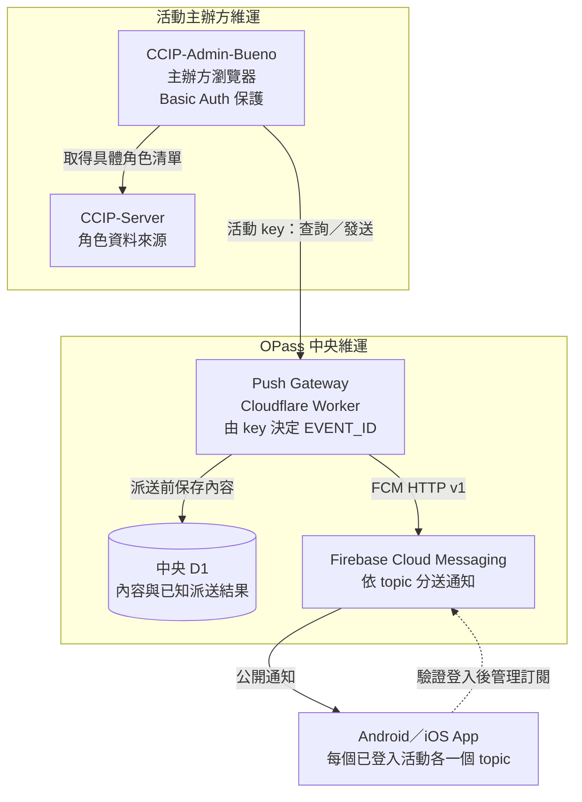

# OPass Push Gateway

OPass Push Gateway 是由 OPass 團隊維運的 Cloudflare Worker，透過 FCM HTTP v1 API 發送活動的公開推播。CCIP-Admin-Bueno 在瀏覽器中使用活動專屬 key 呼叫 Gateway；Firebase service account 由中央保管，不交給活動主辦方。

架構採用中央 D1 保存推播內容與已知派送結果，部署以不綁定有效付款方式為前提。發布版本須通過 [D1 實作驗收](docs/verification.md#d1-實作驗收)及目標環境驗收；架構採納不代表實作或部署已完成。

## 文件導覽

| 文件                                                | 用途                                                |
| --------------------------------------------------- | --------------------------------------------------- |
| [架構與流程圖解](docs/architecture.md)              | 從發送、結果判讀、多活動訂閱到 CSV 交付的閱讀入口   |
| [OpenAPI](openapi.yaml)                             | HTTP 路徑、驗證、request／response 與錯誤語意的規範 |
| [ADR 0001](docs/adr/0001-fcm-topic-push-gateway.md) | Gateway v1 的跨專案契約、信任邊界與取捨             |
| [ADR 0002](docs/adr/0002-content-export-storage.md) | D1 內容保存的理由、必要約束與失敗語意               |
| [操作與 CSV 交付](docs/operations.md)               | 中央設定、發布、事故判讀及活動資料交付流程          |
| [測試與發布驗收](docs/verification.md)              | 自動檢查範圍、跨專案驗收條件與版本證據要求          |

OpenAPI 與 ADR 分別承載 HTTP 契約與架構決策；操作文件說明如何依契約維運。驗證結果記錄在對應 commit、PR 或發布紀錄，部署狀態以指定環境的發布紀錄為準。

初次閱讀可先看下方的系統圖，再讀[架構與流程圖解](docs/architecture.md)，依需要深入 ADR、OpenAPI 或操作文件。

## 本機開發

使用 Node.js 24 以上與 npm。執行期直接使用 Workers Web APIs，開發工具以 `package-lock.json` 固定版本。

```sh
npm ci
cp .dev.vars.example .dev.vars
npx wrangler d1 migrations apply PUSH_RECORDS --local
npm run dev
npm run check
```

`.dev.vars.example` 提供拒絕所有未授權呼叫的空設定；`.dev.vars` 不納入 Git。`npm run dev` 使用本機 bindings，但外部 `fetch` 仍可連網，開發時不使用正式發送憑證。

D1 的資料結構由 [`migrations/`](migrations/0001_push_records.sql) 管理；`wrangler.jsonc` 的零值 database ID 僅供本機開發，部署前由中央維運者填入目標 ID。內容匯出使用 [D1 查詢](reports/content.sql)與[活動 CSV 操作步驟](docs/operations.md#活動內容-csv)。

`npm run check` 執行格式、型別、OpenAPI YAML／本機引用、Workers runtime 與 CSV CLI 測試、dry-run 打包，不部署或發送真實通知。[GitHub Actions](.github/workflows/check.yml) 執行相同檢查；各項命令與驗證邊界見[測試與發布驗收](docs/verification.md)。

## 信任邊界



實線表示 API 呼叫、寫入或通知傳遞；虛線表示 App 的訂閱管理。Server 不參與發送路徑，Firebase service account 只由中央 Gateway 使用。圖示描述共同契約；各元件的整合與發布依[驗收文件](docs/verification.md)確認。

- CCIP-Admin-Bueno 由活動方 reverse proxy Basic Auth 保護；能進入 Admin 的活動主辦方人員都可讀取並使用該活動的 Gateway key。
- Admin 透過 CCIP-Server 既有的 `GET roles` 取得具體角色，將「全體」展開後直接呼叫 Gateway。
- CCIP-Server 只維持既有的活動角色資料來源，不取得 Gateway key、不新增推播 endpoint，也不參與推播發送路徑。
- Gateway 由驗證成功的 key 決定 `EVENT_ID`；request 不接受 `event_id` 或完整 topic。
- Gateway key 只放在受保護且不快取的 Admin runtime config，不提交到公開 repository。
- Firebase service account 只存在於中央 Gateway 的 Cloudflare secret。
- 所有推播內容都是公開資訊；topic 不是機密資料的授權邊界。
- Android 與 iOS 整合時須對每個已登入活動各維持一個 topic；切換顯示中的活動不取消其他活動的訂閱。

## 推播範圍

- 推播有效一小時；活動結束後三十天由 Gateway 停止新派送，輪替 key 不延長期限。
- 通知標題使用中央登記的活動主辦名稱；Admin 發送前先核對 key 對應的活動與可發布狀態。
- 接受漏收，不補送部分或未知結果；FCM 已接受、裝置送達與通知點擊是不同狀態。
- 跨裝置帶入的登入資料須驗證成功後才新增訂閱；訂閱套用狀態不跨裝置同步或從備份沿用。
- 成效只交付平台可取得的送達數、通知點擊數及 CSV；沿用 Firebase／Analytics／BigQuery，主辦方自行保存，不建立報表後台或追蹤後續轉化。
- Gateway v1 只支援採用 FCM 契約的 App，不提供 OneSignal 相容或雙送。iOS 整合須保留送達統計所需的最小 FCM Notification Service Extension；UnifiedPush 不屬於 Gateway v1 的範圍。

## Repository 職責

此 repository 維護 Worker、Gateway 契約、自動測試、內容 CSV 工具與原生成效查詢。Android、iOS 與 CCIP-Admin-Bueno 的實作、測試及發布由各自 repository 負責，引用共同契約。Gateway 自動測試通過後，仍須完成跨專案與目標環境驗收才能發布整合功能。

## License

[GNU Affero General Public License v3.0](LICENSE)
