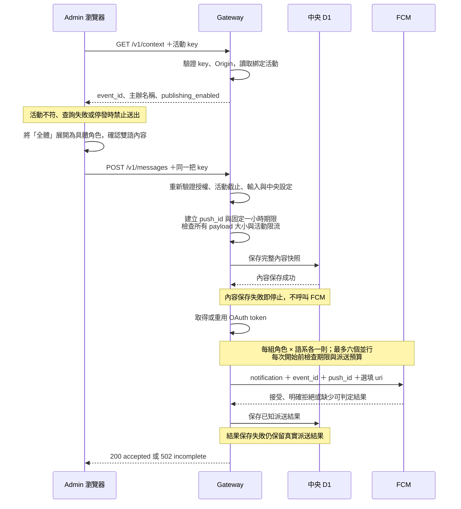
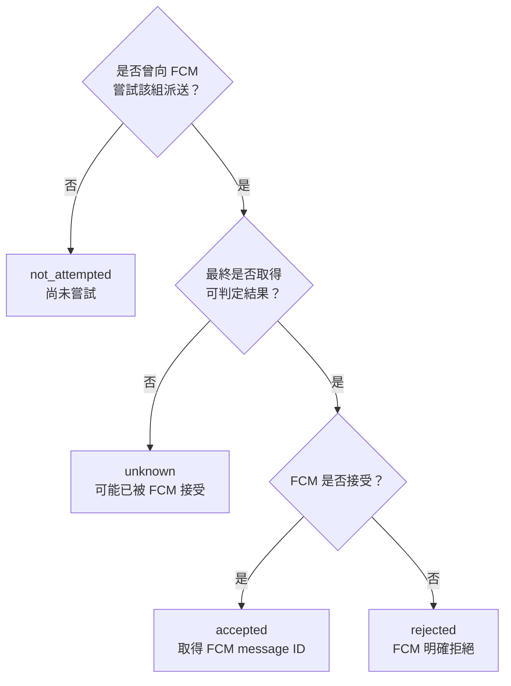
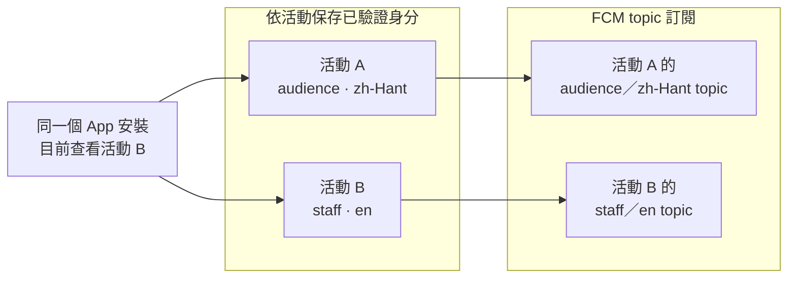
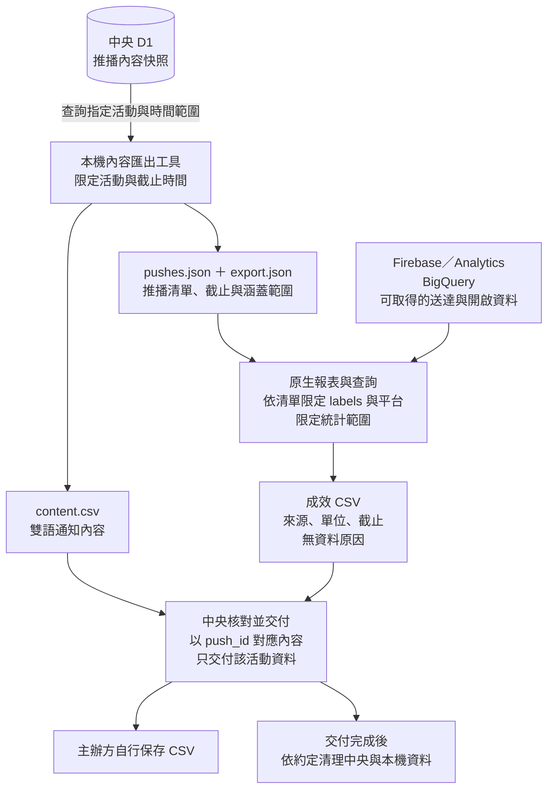

# 架構與流程圖解

OPass Push Gateway 把發布權限集中在中央，以活動專屬 key 隔離發布者，再由 FCM 把公開通知分送給訂閱的 App。先看 [README 的系統與信任邊界](../README.md#信任邊界)，再依下列問題閱讀。

| 想理解的問題                             | 圖解                      |
| ---------------------------------------- | ------------------------- |
| 主辦人員按下發送後，哪些事情依序發生？   | [發送時序](#發送時序)     |
| 成功、失敗與結果未知有何差別？           | [派送結果](#派送結果)     |
| 切換活動、重新登入會改變哪些通知？       | [多活動訂閱](#多活動訂閱) |
| 通知內容如何對應到主辦方拿到的成效數字？ | [CSV 交付](#csv-交付)     |

圖解依 [ADR 0001](adr/0001-fcm-topic-push-gateway.md)、[ADR 0002](adr/0002-content-export-storage.md) 與 [OpenAPI](../openapi.yaml) 說明已採用的設計。Gateway、內容匯出工具與查詢由此 repository 維護；Admin 與 App 的行為由各自 repository 實作及驗收。架構圖不代表 D1 實作、目標環境部署或跨專案整合已通過；證據要求見[測試與發布驗收](verification.md)。

## 發送時序

Admin 先核對 key 所屬活動，讓主辦人員確認活動、角色與內容，再發送。Gateway 在任何 FCM 派送前驗證全部內容並保存對照；以下呈現前置檢查與內容保存成功後的流程。

最多八個角色乘兩個語系，產生最多 16 組派送。每則 FCM payload 都須先通過 2,048-byte UTF-8 檢查；各組與有限重試共用同一個 `push_id` 和到期時間。

只有明確的 `INTERNAL`／500 或 `UNAVAILABLE`／503 才可能重試一次，並遵守 `Retry-After` 與剩餘預算。OAuth 失敗時沒有項目送往 FCM，各組列為 `not_attempted`。活動結束後 30 天停止新派送；整筆尚未開始就到期時回傳 `403`，已開始後則如實記錄剩餘項目。完整錯誤與 HTTP 回應見 [OpenAPI](../openapi.yaml)。

一小時是訊息嘗試送達的有效期限；活動結束後 30 天是發布者能開始新派送的截止。兩者都不會撤回已顯示的通知，也不會登出或取消 App 的活動訂閱。

## 派送結果

每組「角色 × 語系」在有限重試結束後只歸入一種結果。這些是 Gateway 能確認的派送狀態，裝置送達與通知點擊須另外看平台統計。

全部項目被接受才回傳 `200 accepted`；否則回傳 `502 incomplete`，分列已接受及其餘項目。輸入、權限、限流、中央設定或內容保存等前置失敗，則依 OpenAPI 回傳對應錯誤。

**FCM 已接受不等於裝置送達。** 若整個 HTTP 回應遺失，Admin 只能顯示結果未知，可能已有部分送出。部分或未知結果都不補送；D1 缺少派送結果紀錄也不能當成全部未送出。事故處理見[操作文件](operations.md#執行預算與事故判讀)。

## 多活動訂閱

訂閱以「App 安裝 × 已登入活動」分開維護。圖中 App 正在看活動 B，仍保留活動 A 的訂閱；每個活動各有一個對應目前角色與推播語系的 topic。

topic 格式為 `opass-v1.<EVENT_ID>.<ROLE>.<PUSH_LOCALE>`。topic 是公開通知的分組，發布權限由 Gateway key 控制。

| 變化                             | App 應有的行為                                                   |
| -------------------------------- | ---------------------------------------------------------------- |
| 切換目前查看的活動               | 保留其他已登入活動的訂閱                                         |
| 同一活動重新登入、角色或語系改變 | 依該活動目前已驗證身分，先取消舊 topic，再訂閱新 topic           |
| 某活動登出或登入憑證確認失效     | 只取消該活動的訂閱                                               |
| 跨裝置同步或備份帶入登入資料     | 先向對應活動服務驗證成功，再新增訂閱；不沿用還原的「已訂閱」標記 |
| 驗證暫時失敗                     | 保留既有已驗證狀態，稍後再驗證                                   |
| 舊身分的驗證回應較晚抵達         | 忽略過期回應；不能覆寫新身分、清除新憑證或觸發訂閱               |

套用驗證回應前，必須核對發起時的活動與仍有效的身分版本；版本檢查與身分更新須連續完成。SDK 操作另按活動序列化，先在本機保存待完成轉換與可能已訂閱的目標，再操作訂閱，讓中斷後仍能清除殘留 topic。套用狀態與待完成轉換不跨裝置同步或還原；啟動與 FCM registration 更新時重新比對各活動。

這些是 App repository 的整合契約；細節見 [ADR 0001 的 Topic 契約](adr/0001-fcm-topic-push-gateway.md#2-topic-契約)。通知點擊有 HTTPS `uri` 時開啟連結；沒有時依 `event_id` 進入發送活動的公告頁，即使它不是目前查看的活動。

## CSV 交付

通知內容與成效分別來自 D1 和原生平台，以同一個 `push_id` 對照。App 的 Analytics／delivery export 須符合使用者選擇；iOS 送達資料另需要最小 FCM Notification Service Extension 與中央匯出設定。

`content.csv` 提供內容對照，不代表 FCM 已接受或裝置已送達。成效可交付多份 CSV，保留平台、來源、計數單位、截止時間與無資料原因；不可把無資料補成零，或把訊息次數當成不重複的自然人人數。交付不得包含其他活動、token、FID 或逐裝置紀錄。

內容至少保存到 CSV 交付完成，停發不觸發資料清理。來源完整性、匯出介面驗證、原生查詢與交付核對見[操作與交付](operations.md#活動內容-csv)。

## 對照實作與驗收

| 閱讀範圍                     | 程式與驗證入口                                                                                                                                                              |
| ---------------------------- | --------------------------------------------------------------------------------------------------------------------------------------------------------------------------- |
| 活動驗證、context 與 CORS    | [`src/index.ts`](../src/index.ts)、[`src/config.ts`](../src/config.ts)、[`test/context.test.ts`](../test/context.test.ts)                                                   |
| 輸入、期限、保存、派送與結果 | [`src/input.ts`](../src/input.ts)、[`src/messages.ts`](../src/messages.ts)、[`src/firebase.ts`](../src/firebase.ts)、[`test/messages.test.ts`](../test/messages.test.ts)    |
| 活動內容匯出與原生送達查詢   | [`scripts/export-content.mjs`](../scripts/export-content.mjs)、[`reports/fcm-delivery.sql`](../reports/fcm-delivery.sql)、[`test/export.test.mjs`](../test/export.test.mjs) |
| Admin、App、雲端及實機整合   | [跨專案與目標環境驗收](verification.md#跨專案與目標環境驗收)                                                                                                                |
